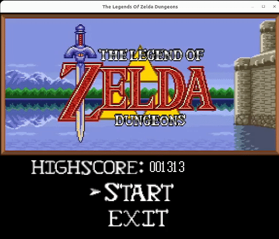

# The Legend of Zelda: Dungeons

## Game Description

In this game you'll be helping Link survive the maximum amount of time in a deadly and strangly repeating dungeon.
As a player you will be defeating monsters that are constantly getting stronger as you traverse through the same 4 rooms.
The rules are simple, you get points by killing monsters and each monster will give you a different amount of points. Your aim as a player is to get maximum amount of points. The game ends when your life drops to 0.

## Instructions

As a player you have 3 different attacks:
- Sword attack: close range attack that deals 20 damage to all the enimies in its range. You can use this attack by pressing in the **space bar**; 
- Bow attack: shoots arrows that deal 10  damage. You can use this attack by pressing **r**; 
- Shield: they say the best attack is the defence, well the shield can protect you of all kinds of damage in the direction you are facing but make sure you do not misstime its activation. You can use your shield by pressing **e**.

## Enemies

At the current time we have 3 different monsters:
- The Rat: the scariest of them all. The rat does not have either an attack nor a strategy to move. It moves randomly through the entire game and can only cause damage by collision serving more as a distraction rather that an enemy.  
- The Fighter: this soldier will chase you down and when he in range he will attack you with a close range attack.
- The Archer: this coward only attacks at a safe distance. He will always try to align with you and when he has a chance he will take the shot, shooting a speedy arrow at your direction. If you try to get near him he will flee and try to get in a safe spot.

## Game Demo

This project was developed by Daniel Bernardo (up202108667@fe.up.pt), Daniel Ferreira (up202108771@fe.up.pt) and Francisco Cardoso (up202108793@fe.up.pt) for LDTS 2022/2023.