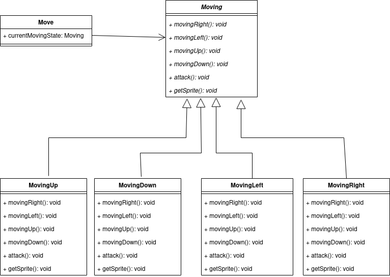
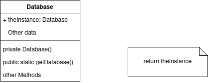

# LDTS_81 - Legend of Zelda: Dungeons

In this game you'll be helping Link survive the maximum amount of time in a deadly and strangly repeating dungeon.

As a player you will be defeating monsters that are constantly getting stronger as you traverse through the same 4 rooms with your mighty sword, shield and bow and arrows.

This project was developed by Daniel Bernardo (up202108667@fe.up.pt), Daniel Ferreira (up202108771@fe.up.pt) and Francisco Cardoso (up202108793@fe.up.pt) for LDTS 2022/2023.

## IMPLEMENTED FEATURES

- **Menu** - The game starts in a menu window so that the player can choose to start the game or quit it. If the player loses or presses 'q' while in the game he will be brought back to the menu;

- **Link Movement** - Link moves in the desired direction by pressing the arrow keys;

- **Link and Monsters Animations** - All of Link's and all the monster's movements and attacks are animated;

- **Camera Movement** - Camera moves throughout the map so that Link is always at its center, except when he's near the borders;

- **Link's weapons** - Link deals damage with its sword and creates projetctiles with its arrows. He also blocks any incoming damage in its facing direction when using the shield;

- **Link's invencibility** - Link becomes invincible for a duration after receiving damage;

- **Collisions** - Implemented collisions between all of the elements of the game (Link, monsters, arrows, walls and hitboxes), each of them having the desired effect (arrows inflict damage when they touch a monster, Link sufferes damage when touching a monster, etc.);

- **Game difficulty increase** - The monsters get stroger and healthier each time the player completes all four rooms;

- **Basic Music** - A theme song is played in the menu and another one is played through the gameplay;

- **Monster's moving and attacking strategies** - Each monster type attacks and moves in their own way: the Rat changes direction randomly; the swordsman chases Link and attack with its sword; and the archer tries to keep his distance and aligns with Link to get a clear shot with its bow and arrows;

- **UI** - Link's health can be seen on the top left corner in the shape of hearts, each monster's health can be checked in a bar above it and the player's score can be seen on the top right corner;

- **Highscore** - The highscore can be seen in the menu and is updated after each game. The highscore is always maintained through different loads of the game.

## PLANNED FEATURES

- **HighScore table** - Create a highscore table after each playthrough, to depict the top 10 scores of all time. It must also let the user go back to the menu or restart the game.

## DESIGN

### GAME ARCHITECTURE

**Problem in Context**

When we started the project we needed a way to seperate de data, the viewing and the logic that was part of each element, as to not violate the "Single Responsability Principle" from the SOLID principles, since each class would need to manage its data, viewing and logic.

**The Pattern**

To solve this issue we are using the MVC (Model-Viewer-Controller) architectural pattern. That way, each major element of the game will be composed of three different classes:

- Viewer: The viewer class will handle the printing of the information that is stored in the Model of the element by using the LanternaGUI;
- Controller: The controller class will use the input that is given by the user and decide how the data from the Model will have to be changed;
- Model : The model class will have all the element's relevant data stored on it. It is also associated with a certain controller and viewer that print its data and decide how and when the data should be changed.

In addition to that, we build a GUI so that our whole program doesn't depend on Lanterna. In the case we want to change Lanterna for anything else, the only thing we have to do is change the code in the LanternaGUI.

**Implementation**

**Consequences**

- The division of the element in this three classes organized the code in a good way and readable way;

- Makes it easy to add features to each individual model, since they are loosely coupled (the implementation of one of the models doesn't interfere the others too much)

### APPLICATION'S STATE

**Problem in Context**

To this moment, our game has a menu and the actual playable game. However, they are two seperate entities that shouldn't be executing at the same time. That said, the overall application should be executing the Menu module or the Game module depending on the state of the application. If this problem wasn't addressed we could have a class with too many lines of code and that violates the "Single Responsability Principle".

**The Pattern**

To solve this issue we used the state pattern. That way, we kept record of the state of the application and implemented the two different states in two different subclasses, so that we could change the module that is running by simply switching the state of tha application. Finally, the necessary code is fragmented between the two subclasses the implement the states.

**Implementation**

The classes that are part of the design pattern are:

- [Game](../legendsOfZeldaDungeons/src/main/java/com/l08gr01/legendsOfZeldaDungeons/Game.java)
- [State](../legendsOfZeldaDungeons/src/main/java/com/l08gr01/legendsOfZeldaDungeons/states/State.java)
- [GameState](../legendsOfZeldaDungeons/src/main/java/com/l08gr01/legendsOfZeldaDungeons/states/GameState.java)
- [MenuState](../legendsOfZeldaDungeons/src/main/java/com/l08gr01/legendsOfZeldaDungeons/states/MenuState.java)

**Consequences**

- The several states represent the different modules of the application (the menu and the game itself);

- Partitions the code into different subclasses, avoiding a class with too many lines of code and an extensive list of if clauses or switch statements;

- Makes it ease to add another possible state to the game (for example the addition of a highscore scoreboard at the end of each game).

### LINK'S AND MONTERS' ANIMATION SPRITES

**Problem in Context**

Our hero Link and all of the monsters have a list of sprites to depict for each direction they can face (left, right, down and up). If they do the same action in the same direction, the next sprite of the animation must be loaded. However, if he faces another direction we must load the sprites regarding that direction. In addition to that we must also depict the correct sprites depending if they are moving or attakcking. If we tried to implement this functionality without the pattern we used, we would end up with a great amount of switch statements (to know in which state Link is in) and for each switch statement we would have to act accordingly as well.

**The Pattern**

To solve these issues we used the state pattern two more times. One of them made it possible for the character to switch between a moving state and a attacking state. That way, when an attack animation ends it immeadiatly transitions to the moving animation again and when a character attacks it changes from to moving state to the attack state. The second usage of the state pattern was on each of the moving states to partition them in each of the four directions they can face. With this, we can change the sprites to be printed by only changing the states of the characters and the moving states.

**Implementation**

The classes that are part of the design pattern are:

- [Move](../legendsOfZeldaDungeons/src/main/java/com/l08gr01/legendsOfZeldaDungeons/model/game/Actions/move/Move.java)
- [Moving](../legendsOfZeldaDungeons/src/main/java/com/l08gr01/legendsOfZeldaDungeons/model/game/Actions/move/movingStates/Moving.java)
- [MovingLeft](../legendsOfZeldaDungeons/src/main/java/com/l08gr01/legendsOfZeldaDungeons/model/game/Actions/move/movingStates/MovingLeft.java)
- [MovingRight](../legendsOfZeldaDungeons/src/main/java/com/l08gr01/legendsOfZeldaDungeons/model/game/Actions/move/movingStates/MovingRight.java)
- [MovingUp](../legendsOfZeldaDungeons/src/main/java/com/l08gr01/legendsOfZeldaDungeons/model/game/Actions/move/movingStates/MovingUp.java))
- [MovingDown](../legendsOfZeldaDungeons/src/main/java/com/l08gr01/legendsOfZeldaDungeons/model/game/Actions/move/movingStates/MovingDown.java)

The classes that are part of the design pattern are:

- [Character](../legendsOfZeldaDungeons/src/main/java/com/l08gr01/legendsOfZeldaDungeons/model/game/Character.java)
- [Action](../legendsOfZeldaDungeons/src/main/java/com/l08gr01/legendsOfZeldaDungeons/model/game/Actions/Action.java)
- [Move](../legendsOfZeldaDungeons/src/main/java/com/l08gr01/legendsOfZeldaDungeons/model/game/Actions/move/Move.java)
- [Attack](../legendsOfZeldaDungeons/src/main/java/com/l08gr01/legendsOfZeldaDungeons/model/game/Actions/attack/Attack.java)

**Consequences**

- Avoids a huge amount of switch and if statementes by fragmenting the code into multiple subclasses;

- Makes it easy to add new animations to Link by adding more states if necessary, making so that the code that was already written doesn't need to be modified ("Open-Closed Principle")

### MONSTER'S ATTACK AND MOVING STRATEGIES

**Problem in Context**

We want to be able to create various enemies each with their particular way of attacking and moving. However, different enemies can move in the same way or even attack in the same way. To avoid a huge amount of switch statements (to check the type of monster) we could create a subclass for each monster where the function on how to attack and how to move could be implemented. However, if a lot of monsters moved in the same way (use the same moving startegy) there would be a lot of unnecessary copied code between the subclasses.

**The Pattern**

To solve this problem we used the strategy pattern. This way, each monster will have a movingStrategy and an attackingStrategy as an attribute and will move and attack by executing the corresponding strategy. For each movement strategy and attack strategy that we may need we only need to add a new subclass that implements the MovingStrategy or AttackStrategy interface.

**Implementation**

The classes that are part of the design pattern are:

- [Monster](../legendsOfZeldaDungeons/src/main/java/com/l08gr01/legendsOfZeldaDungeons/model/game/monster/Monster.java)
- [MoveStrategy](../legendsOfZeldaDungeons/src/main/java/com/l08gr01/legendsOfZeldaDungeons/model/game/monster/moveStrategy/MoveStrategy.java)
- [RandomMovement](../legendsOfZeldaDungeons/src/main/java/com/l08gr01/legendsOfZeldaDungeons/model/game/monster/moveStrategy/RandomMovement.java)
- [ChaseMovement](../legendsOfZeldaDungeons/src/main/java/com/l08gr01/legendsOfZeldaDungeons/model/game/monster/moveStrategy/ChaseMovement.java)
- [AlignStrategy](../legendsOfZeldaDungeons/src/main/java/com/l08gr01/legendsOfZeldaDungeons/model/game/monster/moveStrategy/AlignStrategy.java)
- [AttackStrategy](../legendsOfZeldaDungeons/src/main/java/com/l08gr01/legendsOfZeldaDungeons/model/game/monster/attackStrategy/AttackStrategy.java)
- [NullAttack](../legendsOfZeldaDungeons/src/main/java/com/l08gr01/legendsOfZeldaDungeons/model/game/monster/attackStrategy/NullAttack.java)
- [MeleeAttack](../legendsOfZeldaDungeons/src/main/java/com/l08gr01/legendsOfZeldaDungeons/model/game/monster/attackStrategy/MeleeAttack.java)
- [AlignedAttack](../legendsOfZeldaDungeons/src/main/java/com/l08gr01/legendsOfZeldaDungeons/model/game/monster/attackStrategy/AlignedAttack.java)

**Consequences**

- Lets different monsters have the same movement or attacking strategy without having to rewrite the code. That way a modification to a strategy won't need to be changed in each monster that has that strategy;

- The Monster class doesn't need to know the specifications of how he moves and attacks, he only needs to know which strategy it follows;

- Adding a new way of attacking and moving doesn't change pre-existent code;

- The way a monster attacks and moves can be easily changed by only changing its strategies.

### SPRITES AND HIGHSCORE DATABASE

**Problem in Context**

In our project we use a class Image that reads an image in the png format and converts it into a matrix of colors. In the midst of development we realized that we weren't storing that information anywhere, and because of that, we were doing this convertion in each game cycle, making our game less eficient. Because of that we created a Database class to store all this information. However we didn't want to create more than one Database instance, so that we wouldn't run into the problem we were facing in the past (converting the same images into matrixes of colors more than once).

**The Pattern**

To solve this issue we decided to implement the **Singleton Pattern**. For that we made the Database constructor private (so that it couldn't get called by any other class) and created a public static method that returns an instance of the Database class. This method calls the Database constructor the first time it is called, storing it in a attribute of the Database class, and returns that instance in each successive call. That way, the Database constructor will create each color matrix of each sprite once and only once.

**Implementation**

The class that is part of the design pattern is:

- [Database](../legendsOfZeldaDungeons/src/main/java/com/l08gr01/legendsOfZeldaDungeons/Database.java)

**Consequences**

- Each sprite isn't loaded more than once, contributing to the game's efficiency;

- The programmer won't have to worry about accidentally creating a new database that would load all the sprites once again;

## KNOWN CODE SMELLS AND REFACTORING SUGGESTIONS

### COUPLERS: FEATURE ENVY

Because of our architectural choice (using the MCV architecture), our controllers deeply envy their models, that is, they use their models' data and operations very often and more frequently than the its model class. In this case. this code smell comes from the choice of using the MVC architecture and shouldn't be removed since it helps on the code's organization and simplicity.

### Dispensables: Data Classes

Once again, because of our choice to use the MVC architecture our Models are essentially Data Classes, that is, classes that only have fields and methods that access those fields.
In addition to that, our database and sprites classes are also data classes, which also helps with code organization, making it easy to change a character's sprites.

### Dispensables: Middle Man

Most of our Database class methods only delegate work to one of the Sprites classes. Because of that our Database serves as a middle mean between the models of our game and the sprites classes that hold the sprites to be used. To refactor to this code we could use the **Remove Middle Man** refactor making the models call the sprites Classes getters directly instead of relying on the database. We chose not to do that because of the implementation of the Singleton pattern. If we had removed the middle man we would either have to implement the Singleton Pattern in each Sprite Class or initialize all the sprites and pass them throughout the code without any safety net.

## TESTING

### TEST COVERAGE

### PITEST REPORT

## Game Demo

## SELF-EVALUATION

- Daniel Bernardo: 33%
- Daniel Ferreira: 33%
- Francisco Cardoso: 33%